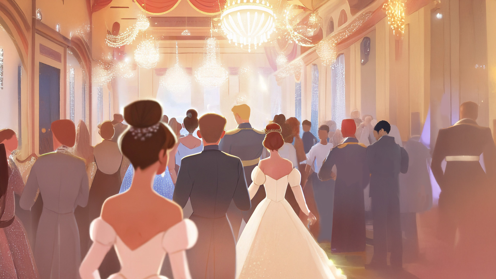
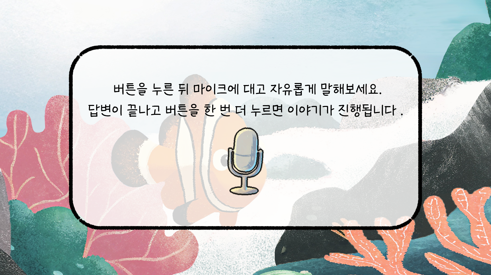

<!-- Using HTML to center the abstract -->

  

    <h2>작품 개요</h2>
    

      <strong>COLOR : FULL</strong>은 목소리를 색으로 표현하는 인터랙티브 미디어아트입니다.
    

  

 

  

    <h2>기획 의도</h2>
    

      모두가 저마다 다른 목소리를 지니고 있듯, 우리는 모두 유일한 존재입니다. <strong>COLOR : FULL</strong>은 ‘목소리’라는 개개인의 고유성 속에서 나만의 색을 찾아가는 여정을 담고 있습니다. 이 여정을 통해 우리는 각자의 목소리, 나아가 개인의 고유성이 얼마나 아름답고 소중한 것인지 전하고자 합니다.   
목소리에 정답이 없듯, 색깔에도 우열은 없습니다. <strong>COLOR : FULL</strong>을 체험하며 자기가 가진 목소리의 색을 발견하고, 있는 그대로의 나를 따뜻하게 마주하는 시간을 갖길 바랍니다.
    

  

 

## 아트워크 
<h3><li>오프닝</li></h3>

  
  

<h3><li>메인 스토리</li></h3>

  
  
  
  
  

<h3><li>진행 예시</li></h3>

  
  
  

## 팀원 소개
  

      <section>
    

      

        <h3>김민지</h3>
        <ul>
          <li>@naver.com</a></li>
        </ul>
      

      

        <h3>문혜정</h3>
        <ul>
          <li>mhj2522@naver.com</a></li>
        </ul>
      

      

        <h3>서나진</h3>
        <ul>
          <li>@naver.com</a></li>
        </ul>
      

    

  </section>
  

</code></pre>

