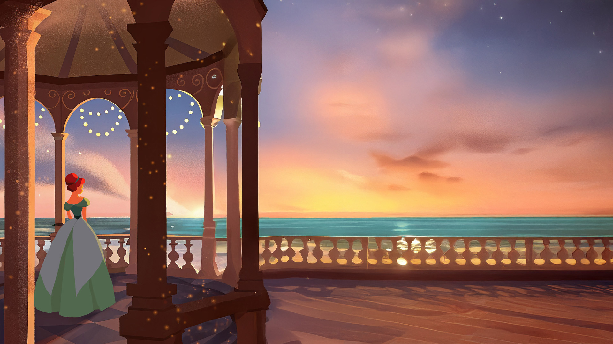

<!-- Using HTML to center the abstract -->

  

    <h2>작품 개요</h2>
    

      <strong>COLOR : FULL</strong>은 목소리를 색으로 표현하는 인터랙티브 미디어아트입니다.
    

  

## 팀원 소개
  

    김민지
    문혜정
    서나진
  

## 아트워크 

  <h3>오프닝</h3>
  
  
  <h3>메인 스토리</h3>
  
  
  
  <h3>진행 과정</h3>
  

</code></pre>

